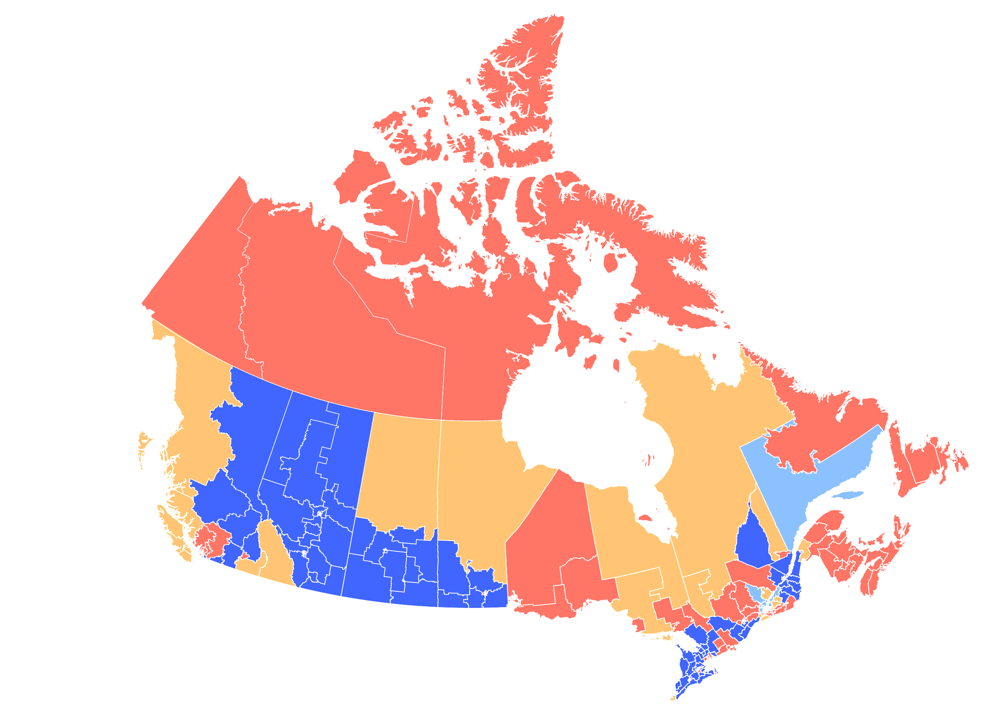
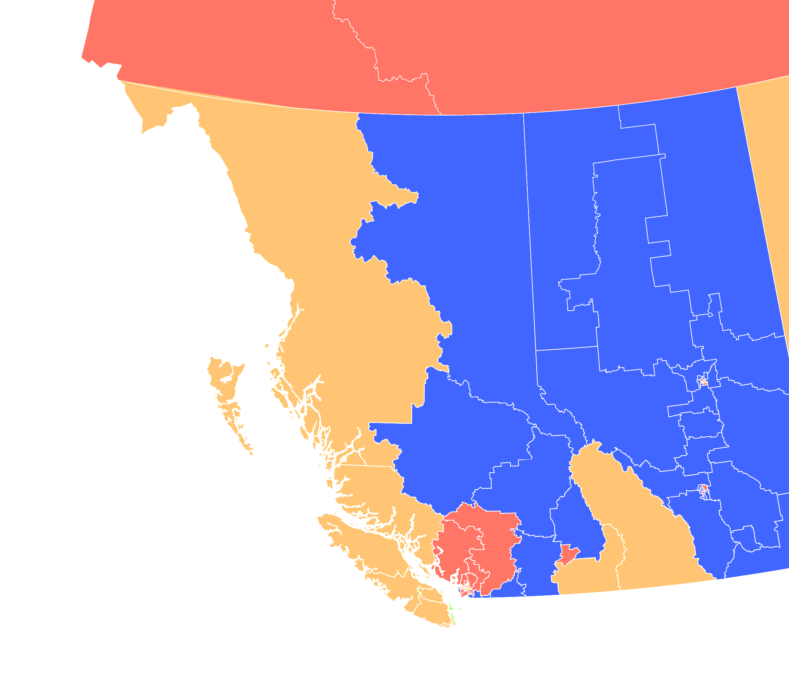
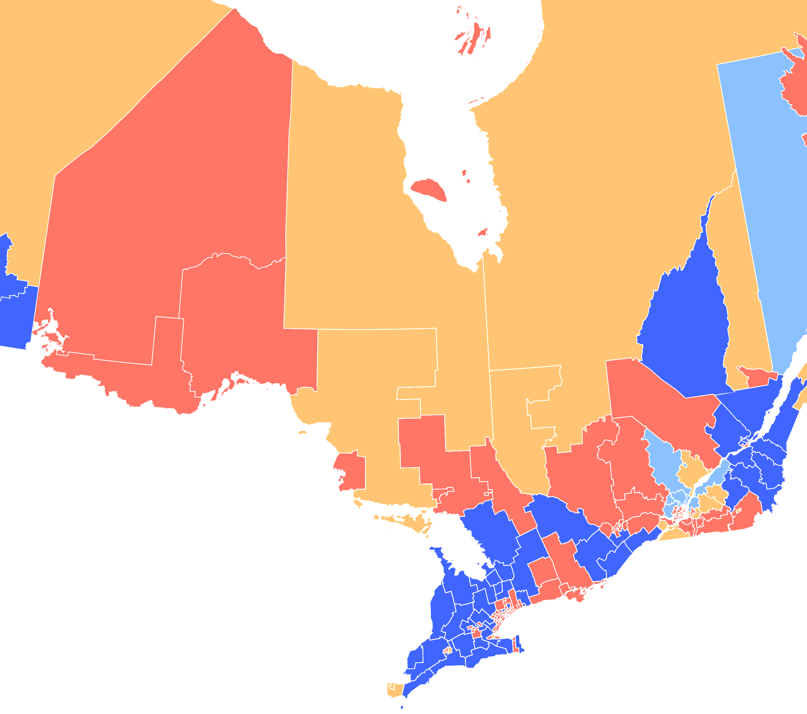
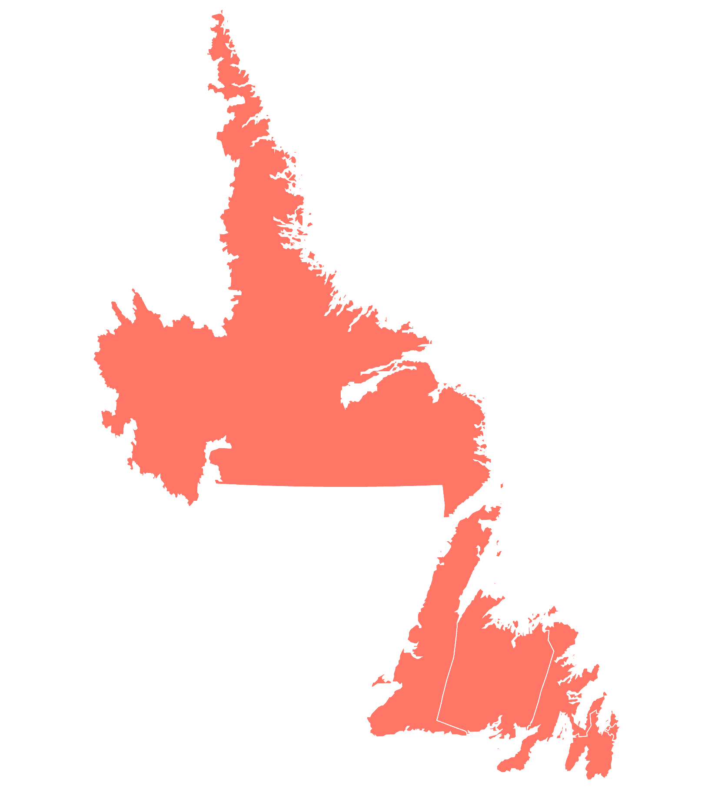
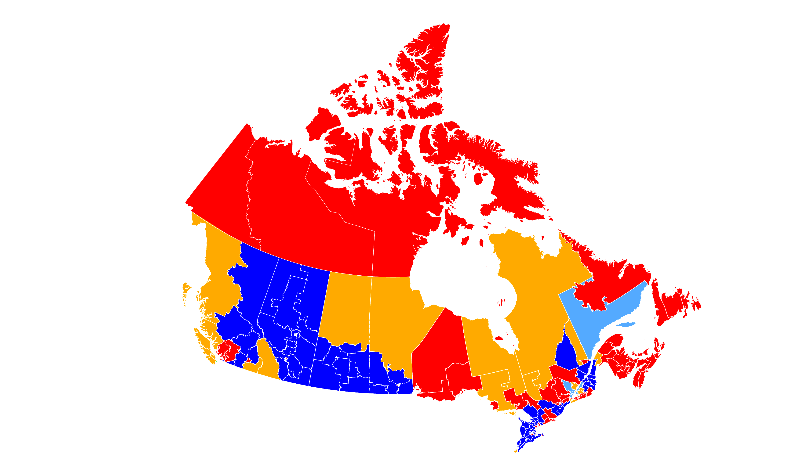

# 2015 Canadian Federal Election results by riding, via Albers

Albers projection experiments ftw, via [tangram.js](https://tangrams.readthedocs.io) shaders. 

[2015 electoral results](https://www.elections.ca/content.aspx?section=res&dir=rep/off/42gedata&document=summary&lang=e) and [electoral geometries](https://www12.statcan.gc.ca/census-recensement/2011/geo/bound-limit/bound-limit-2016-eng.cfm) via Statistics Canada, mreged via [HERE XYZ](https://here.xyz).

More electoral stats [here](xyz-space-invader.netlify.com/?space=wF72Pj6d&token=AFbjoHrBlTB2K5_gqvcP_S8&basemap=albers&buildings=0&label=&colors=range&points=1&lines=0&outlines=3&places=0&roads=0&hexbins=0&water=0&extrusion=undefined&property=Percentage+of+Voter+Turnout%2FPourcentage+de+la+participation+électorale&palette=colorBrewerYlOrRd&paletteFlip=false&sort=values&hideOutliers=false#4.7/63.816/-98.345)

(For Americans: red = Liberal, blue = Conservatives, orange = NDP, light blue = Bloc Quebecois, green = Green Party)

